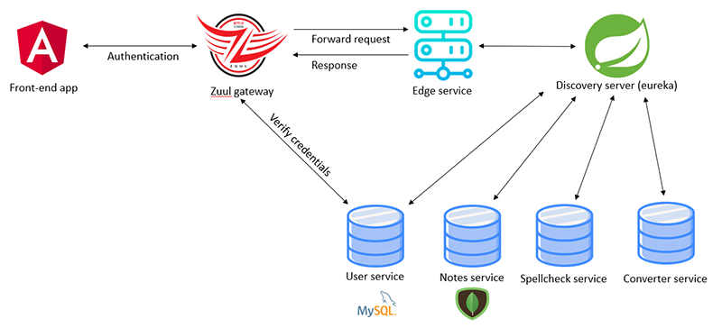
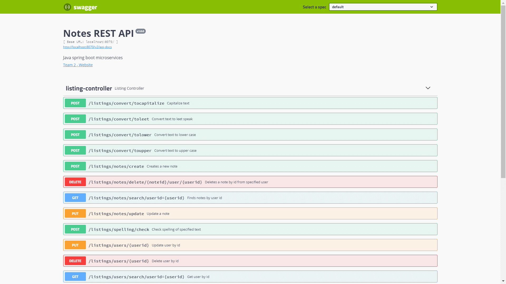

<h1 align="center">
  
  
NotesApp

</h1>

<h4 align="center">Java Spring Boot Microservices Project</h4>

## About
This is a simple Java backend powered by microservices. Users can register, log in, create notes, optionally check them for spelling errors or convert them to a different format.

## Overview

## Microservices
Below is a list of all required services to run this project:
* [users](user-service)
  * stores user credentials
  * MySQL database
* [notes](note-service)
  * stores notes
  * MongoDB database
* [converter](converter-service)
  * converts notes to different formats
* [spelling checker](spell-check-service)
  * checks notes for common misspelled words
* [zuul gateway](zuul-gateway)
  * proxy gateway that handles user authentication
  * authenticates users using the `user-service`
  * forwards requests to the `edge-service`
* [edge service](edge-service)
  * one API that calls multiple internal services
* [eureka server](discovery-server)
  * locates services
  * load balancer

For more detailed info, see the README of each service separately.

## Developers
| [ <b>Sleeyax</b>](https://github.com/sleeyax)  | [ <b>Dries Luyten</b>](https://github.com/r0699049)  |[ <b>stijnhhh</b>](https://github.com/stijnhhh)  | [ <b>Karel</b>](https://github.com/karelroetss) 
| :---: | :---: | :---: | :---: | 